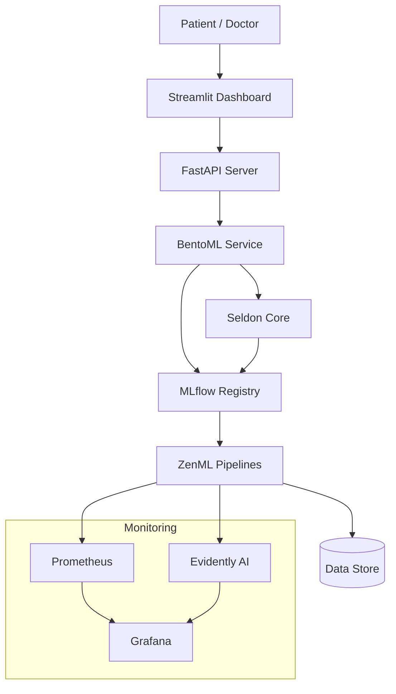

# 🚑 Early Disease Detection AI System

Modern, trustworthy, **production-grade MLOps pipeline** for early disease prediction and risk detection — powered by **ZenML**, **MLflow**, **BentoML**, **Seldon Core**, **FastAPI**, **Streamlit**, **Prometheus**, **Evidently AI**, **Tailwind CSS**, and full **CI/CD** best practices.

## 🎯 Project Mission

Healthcare needs **proactive tools** to detect diseases early — saving lives, reducing costs, and empowering doctors with **data-driven insights**.

This project is an **end-to-end AI system** that combines **advanced MLOps**, **explainability**, **privacy**, and **human-centered design** to deliver **actionable predictions** and **transparent risk explanations**.

---

## 🛠️ Tech Stack

| Layer                    | Tools & Libraries                                             |
| ------------------------ | ------------------------------------------------------------- |
| 🧩 ML Pipelines          | ZenML, DVC, Pandas, scikit-learn, XGBoost                     |
| 🔍 Experiment Tracking   | MLflow (Tracking & Registry)                                  |
| 📦 Serving & Deployment  | BentoML, Seldon Core, FastAPI                                 |
| 🎨 Frontend              | Streamlit, Tailwind CSS, Figma (design system)                |
| 🔑 MLOps & Orchestration | Docker, Kubernetes, Helm, GitHub Actions, Prometheus, Grafana |
| 📈 Monitoring            | Evidently AI (data drift)                                     |
| 🔒 Security              | .env configs, Role-Based Access Control (RBAC planned)        |

---

## 🗂️ Key Features

✅ Modular ML pipelines (ingestion, preprocessing, training, deployment)

✅ Versioned data & model tracking with DVC & MLflow

✅ Real-time, scalable API serving with FastAPI, BentoML & Seldon

✅ Explainability with SHAP and LIME

✅ Beautiful patient & doctor dashboards (Streamlit + Tailwind)

✅ Monitoring with Prometheus, Grafana & Evidently AI

✅ Fully automated CI/CD (GitHub Actions)

✅ Cloud-native: Docker, Kubernetes, Helm

---

## 🏛️ High-Level Architecture



---

## ⚙️ Local Setup

```bash
# Clone the repo
git clone https://github.com/priyanshumishra610/early-disease-detection.git
cd early-disease-detection

# Create a virtual environment & activate
python -m venv .venv
source .venv/bin/activate  # Linux/macOS
# OR
.venv\Scripts\activate  # Windows

# Install dependencies
pip install -r requirements.txt

# Run ZenML pipelines (example)
python pipelines/ingestion_pipeline.py
python pipelines/preprocessing_pipeline.py
python pipelines/training_pipeline.py

# Serve the FastAPI backend
uvicorn api.fastapi_app:app --reload

# Launch the Streamlit frontend
streamlit run frontend/streamlit_app.py
```

---

## 🐳 Run with Docker Compose

```bash
docker-compose up --build
```

---

## ✅ Testing

```bash
pytest tests/
```

---

## 📊 Monitoring

* **MLflow Tracking UI:** [http://localhost:5000](http://localhost:5000)
* **Prometheus & Grafana:** Included in `docker-compose.yml`
* **Evidently AI:** For drift detection reports

---

## 🔐 Environment Variables

All secrets and configuration keys are managed securely via **`.env`** files.
**Never commit real credentials!** Always use `.env.example` as your template.

---

## 🚀 Roadmap

* ✅ **Phase 1:** Core structure, pipelines, configs, CI/CD, Docker Compose, initial tests.
* 🔄 **Phase 2:** End-to-end pipelines with real data, robust MLflow tracking, BentoML packaging, live API serving.
* 🔐 **Phase 3:** Secure frontend-backend connection, SHAP/LIME explainability, user authentication (RBAC).
* ☸️ **Phase 4:** Helm-based deployment on Kubernetes (GKE, EKS, AKS) with live monitoring.
* 🌐 **Phase 5:** Advanced Figma design system, Tailwind styling, improved doctor/patient workflows, mobile-friendly UI.

---

## 💡 Future Vision

* Integrate a **Feature Store** (Feast) for advanced feature management.
* Support **multiple disease models** and plug-in extensions.
* Enable **community-driven contributions**.

---

## 🤝 Contributing

Your ideas, issues, and pull requests are **highly welcome**!

```bash
# Fork this repo
# Create a branch
git checkout -b feature/your-feature

# Commit your changes
git commit -m 'Add new feature'

# Push to your branch
git push origin feature/your-feature

# Open a Pull Request!
```

---

## 🏷️ License

**MIT License** — use it, share it, make it better.

---

## ✨ Built with ❤️ by [Priyanshu Mishra](https://github.com/priyanshumishra610)

If you find this project valuable — **⭐️ Star it**, **share it**, and **contribute!**


